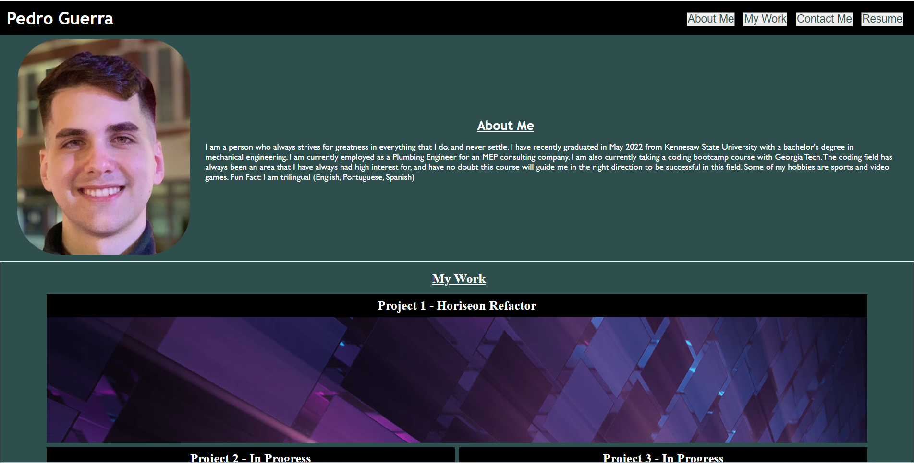

# Pedro Guerra Portfolio

## Description

In this bootcamp challenge, the main goal is to create a code from scratch, that displays a portfolio. This portfolio will include basic information about myself, and some history of the biggest projects that I have done throughout this course. The first section is an "about-me", in which I briefly describe myself. The second section is a "my work" section, where I will provide 5 of the biggest projects that I have worked on. The last section is called "contact me", and it will contain information on how to reach me via e-mail and mobile number, also with links to my GitHub and LinkedIn profiles.

## Installation

N/A

## Usage

This challenged allowed me to improve my coding skills as I had to start this code from scratch and only rely on the class information that I learned. However, the class information was super helpful and although there is much room for me to improve on, I was able to put something together that kind of works haha.

Deployed Website Link: <a href="X">Deployed Website Link</a>

## Credits

Google Images (for project backgrounds)

## License

MIT License
